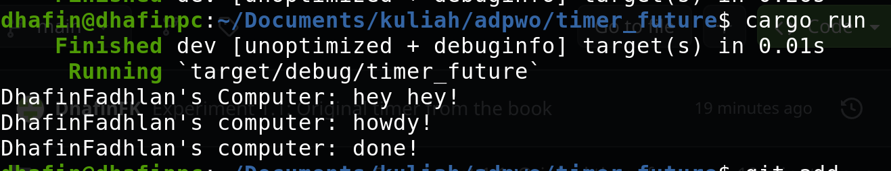

### 1.2
The output is like the image above because I instantiated executor and spawner first. Then I spwan the asynchronous task that will not execute immediately, but wait for the executor to execute it. Then I print "DhafinFadhlan's Computer: hey hey!" synchronously before the executor executes the asynchronous task. Therefore printing that output before other outputs

### 1.3
From the picture above, we can conclude that this time the executor ran more tasks compared to the previous version of the code (see commit 1.2). The reason behind it is that there new tasks spawned and entered to the sender queue. The drop(spawner) code which is now commented out causes the program to never stop and keeps on running. The program keeps on running because the program assumes that there will be more tasks sent to the executor.